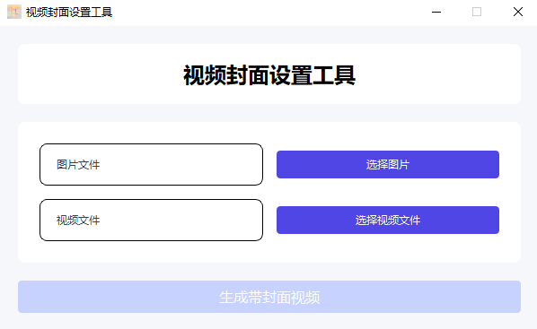
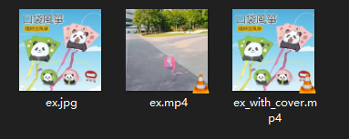

# my-ffmpeg-tools

# 概述

该仓库内容是平时练手的一个项目，其主体功能是支持替换视频的封面。

后续可能会添加更多 ffmpeg 功能，如视频分辨率转换，图片分辨率转换，视频音频提取等。

# 打包

```cmd
python -m nuitka --onefile --standalone --windows-icon-from-ico=resource/LLCover.ico `
--copyright=LL@LiangMingJian --product-name=LLCover `
--file-version=1.0 --file-description=LLCover --enable-plugin=pyside6 `
--windows-console-mode=disable --output-filename=LLCover.exe `
main.py
```

# 示例




